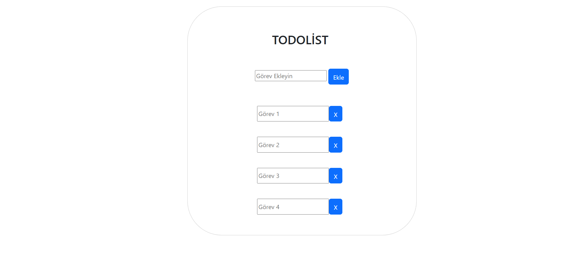

## 📋 Todolist - Görev Yönetim Uygulaması

JavaScript ve DOM manipülasyonu kullanılarak geliştirilmiş sade ve dinamik görev yönetim uygulaması

## 🛠️ Kullanılan Teknolojiler

* **HTML5:** Sematik web yapısı
* **CSS3:** Stil ve arayüz özelleştirmeleri
* **Bootstrap:** Hızlı ve modern UI bileşenleri
* **JavaScript:** Dinamik DOM yönetimi ve liste yapısı

## ✨ Öne Çıkan Özellikler

* **Dinamik Görev Ekleme:** Kullanıcı girdisine göre anlık olarak listeye yeni görev ekler
* **Görev Silme:** İstediğiniz görevi tek butonla silme

## 🚀 Uygulamaya Git

* [Todolist](https://fatih050.github.io/todolist-proje/)

## 🖼️ Arayüz Önizlemesi

